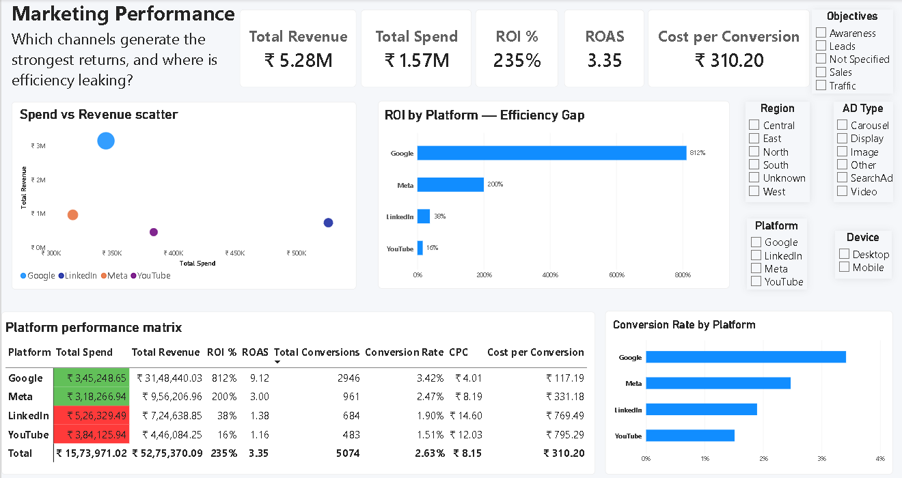

# Marketing Performance Analytics — End-to-End Case Study

> **From raw campaign data to budget decisions:** data preparation, KPI engineering, analytical modeling, Power BI dashboarding, and business recommendations.

## Business Question

**Which marketing channels generate the strongest returns, and where is efficiency leaking?**

This project evaluates campaign performance across **Google, Meta, LinkedIn, and YouTube**, with a focus on spend efficiency, revenue generation, conversions, and unit economics across regions, objectives, devices, and ad types.

The goal is not to produce a dashboard for its own sake. The goal is to turn campaign data into **decision-ready marketing intelligence**.

---

## Analytical Workflow

```text
Raw Campaign Data
       ↓
Data Cleaning & Validation
       ↓
KPI Engineering
       ↓
Comparative / Exploratory Analysis
       ↓
Power BI Data Model & DAX Measures
       ↓
Interactive Dashboard
       ↓
Business Insights & Recommendations
```

### 1. Data preparation

The campaign data was structured into a consistent analytical table by:

- Standardizing platform, region, objective, device, and ad-type categories
- Validating numeric fields and handling inconsistent records
- Removing structural noise and unusable rows
- Preparing a clean dataset for BI analysis

### 2. KPI engineering

Decision-relevant metrics include:

- **Total Spend**
- **Total Revenue**
- **ROI %**
- **ROAS**
- **Total Conversions**
- **Conversion Rate**
- **CPC**
- **Cost per Conversion**

### 3. Power BI modeling & analysis

The cleaned campaign table was modeled in **Power BI**, with DAX measures used to calculate the core performance metrics and compare channel economics.

The dashboard supports interactive analysis by:

- Platform
- Region
- Objective
- Ad Type
- Device

---

## Dashboard

### Marketing Performance — Channel Efficiency View

The final Power BI dashboard is designed around four decision questions:

1. **Where is marketing spend producing the strongest financial return?**
2. **Which channels show an efficiency gap?**
3. **How do conversion rates differ across platforms?**
4. **Where should budget be protected, optimized, or challenged?**

The primary deliverable is the **Power BI analytical layer**, not the earlier spreadsheet dashboard.



> **Power BI file:** `Marketing_Performance_Analytics.pbix`  
> Open it in Power BI Desktop to explore the interactive model, measures, filters, and dashboard.

---

## Key Findings

### Google is the clear efficiency leader

- **812% ROI**
- **9.12 ROAS**
- **2,946 conversions**
- **₹117.19 cost per conversion**

Google generates substantially stronger returns than the other platforms while also maintaining the lowest CPC in the final analytical view.

### Meta is the secondary performance channel

- **200% ROI**
- **3.00 ROAS**
- **961 conversions**
- **₹331.18 cost per conversion**

Meta remains economically viable, but its return profile is materially weaker than Google.

### LinkedIn and YouTube show major efficiency pressure

- LinkedIn: **38% ROI**, **₹769.49 cost per conversion**
- YouTube: **16% ROI**, **₹795.29 cost per conversion**

These channels warrant tighter targeting, experimentation, and budget scrutiny rather than automatic budget expansion.

### Overall economics

- **Total Revenue:** ₹5.28M
- **Total Spend:** ₹1.57M
- **Overall ROI:** 235%
- **Overall ROAS:** 3.35
- **Total Conversions:** 5,074
- **Overall Cost per Conversion:** ₹310.20

---

## Business Recommendations

### 1. Protect and selectively scale high-efficiency spend

Prioritize Google for incremental performance budget while monitoring whether marginal returns remain sustainable as spend increases.

### 2. Keep Meta as a complementary performance channel

Maintain Meta as a secondary acquisition channel and optimize targeting, creative, and objective mix before increasing spend aggressively.

### 3. Challenge LinkedIn and YouTube economics

Investigate the high cost per conversion and low ROI before allocating additional budget. Test narrower audiences, creative formats, and campaign objectives.

### 4. Use the dashboard as a decision tool

The dashboard is built to compare channels interactively and surface where marketing efficiency is improving or deteriorating—not simply to report historical totals.

---

## Repository Structure

```text
├── README.md
├── Marketing_Performance_Analytics.pbix
├── marketing_performance.png
├── raw_marketing_data.xlsx
└── cleaned_marketing_data.xlsx
```

The Excel files are retained as **source/data-preparation artifacts**. They are not the primary analytical deliverable. The portfolio-facing analysis and interactive reporting layer are built in Power BI.

---

## Tools & Skills Demonstrated

**Analytics**
- Data Cleaning & Validation
- Exploratory / Comparative Analysis
- KPI Design
- Marketing Performance Analysis
- Channel Efficiency Analysis
- Business Recommendation

**BI & Data Modeling**
- Power BI
- Power Query
- DAX Measures
- Data Modeling
- Interactive Slicers
- KPI Cards
- Performance Matrix
- Comparative Visualizations

**Business Concepts**
- ROI & ROAS
- Conversion Rate
- CPC & Cost per Conversion
- Budget Allocation
- Channel Performance
- Marketing Efficiency

---

## Project Outcome

This case study demonstrates an end-to-end analytical workflow: **starting with imperfect campaign data, structuring it for analysis, engineering decision-relevant KPIs, building an interactive Power BI reporting layer, and translating the results into concrete marketing actions.**

The emphasis is on **analytical reasoning, performance economics, and business impact**—not on Excel formatting or dashboard decoration alone.

---

### Aashka Tanvi

**Data Analytics | Marketing Analytics | Business Intelligence**
