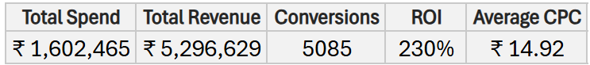
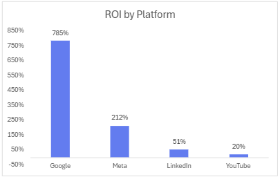
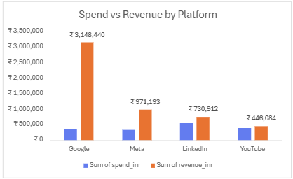
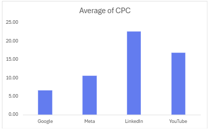
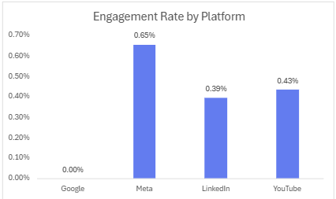
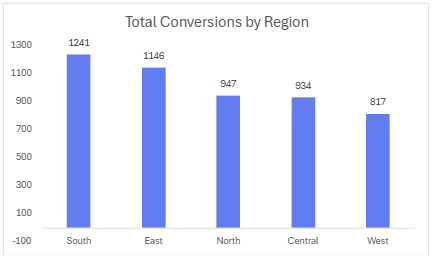

📊 Marketing Campaign Performance Analysis (Excel Project)

### **An end-to-end Excel analytics project analyzing marketing performance across Google, Meta, YouTube, and LinkedIn using KPIs, dashboards, and insights.**

---

## 🚀 **Project Overview**

This project explores a real-world style marketing dataset (305 rows, 13 columns) to evaluate the performance of four advertising platforms and five regions. The goal is to understand ROI, CPC behavior, engagement patterns, and regional conversion performance — and provide actionable recommendations.

The project includes:

- Structured raw → cleaned → processed workflow  
- KPI summary (Spend, Revenue, ROI, Conversions, Avg CPC)  
- Dashboard visuals  
- Platform-level insights  
- Regional performance breakdown  
- Professionally written 1-page summary PDF  

---

## 📁 **Repository Structure**
• Excel workbook (Raw → Cleaned → Analysis → Dashboard)

• Insights & Summary

• Screenshots folder
---

## 🧹 **Data Cleaning Workflow**

- Removed duplicates and unnecessary spaces  
- Standardized naming conventions (platforms, regions)  
- Fixed inconsistent formats in numeric columns  
- Converted text-numbers → numeric values  
- Added calculated fields (CPC, ROI%, Engagement Rate)  

---

## 📈 **Key Metrics (KPIs)**

- **Total Spend**  
- **Total Revenue**  
- **Total Conversions**  
- **ROI (%)**  
- **Average CPC**  

---

## 📊 **Dashboard Visuals**

### **KPI Snapshot**

### **ROI by Platform**

### **Spend vs Revenue by Platform**

### **Average CPC by Platform**

### **Engagement Rate by Platform**

### **Total Conversions by Region**

---

## 🔍 **Key Insights**

### ⭐ **Google delivers the strongest ROI (785%)**
- Lowest CPC (₹6.68)  
- Best overall conversion performance  

### ⭐ **Meta leads engagement (0.65%)**
- Strong awareness + audience interaction  

### ⭐ **LinkedIn is the most expensive platform (CPC ₹22.60)**
- Low ROI  
- Best used for B2B or niche audiences  

### ⭐ **YouTube has weakest ROI (20%)**
- Higher CPC  
- Low revenue return  

### ⭐ **High-performing regions: South & East**
- Highest conversion volume  
- Strongest response to campaigns  

---

## 🧭 **Recommendations**

- Increase budget allocation for **Google** (best ROI).  
- Use **Meta** for engagement and brand awareness.  
- Limit **LinkedIn** spend (high CPC).  
- Optimize or reduce **YouTube** spend.  
- Target **South & East** regions for performance campaigns.  

---

## 📄 **Project Summary PDF**

A professionally formatted 1-page summary is included:

[Marketing_Campaign_Summary.pdf](Marketing_Campaign_Summary.pdf)

---

## 🔗 **Project Files (OneDrive Link)**  
👉 *https://1drv.ms/f/c/1f625f87ab73d63a/IgCwoYZbABWFRI1QMuY1NAS3AZbdFbNPDZvEh909pxH4Mn8?e=81SuW6*

---

## 🧠 **Tools Used**

- Microsoft Excel  
- Data Cleaning  
- Pivot Tables  
- Dashboarding  
- KPI Analysis  

---

## 👩‍💻 **Author: Aashka Tanvi**

Focused on analytics and insights — turning business data into decisions.

